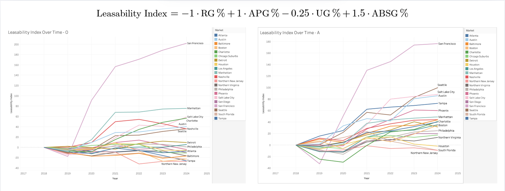
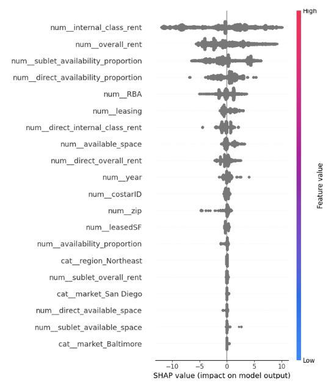
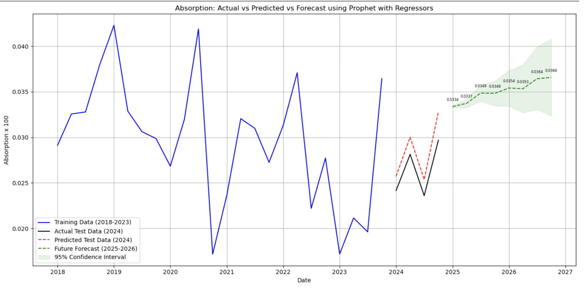

# Savills Market Analysis: Office Space Utilization Trends (2020-2024)

## Project Overview
This project analyzes commercial real estate market trends, focusing on the post-pandemic recovery across major US markets. The analysis leverages proprietary data from Savills, a leading international commercial real estate firm, to provide insights into office space utilization, rental trends, and market dynamics following the COVID-19 pandemic.

## Team Members
- Abhinav Meduri
- Aashish Cheruvu
- Shravan Selvavel
- Sharad Parulekar

## Project Context
As businesses navigate the post-pandemic landscape, understanding commercial real estate trends has become increasingly complex. This project aims to help commercial real estate firms like Savills provide data-driven recommendations to clients regarding office space utilization, market selection, and investment strategies.

## Key Questions Addressed
1. How has office space occupancy changed across different markets post-COVID?
2. What are the emerging trends in commercial real estate leasing?
3. How do different sectors (Tech, Legal, Financial) compare in their space utilization patterns?
4. What factors most significantly impact commercial real estate pricing and availability?

## Methodology
Our analysis leverages several advanced analytical approaches:

### 1. Time Series Analysis
- Utilized Facebook's Prophet model to forecast occupancy trends
- Analyzed seasonal patterns and long-term market movements
- Identified market-specific recovery trajectories

### 2. Machine Learning Models
- Implemented SHAP (SHapley Additive exPlanations) for feature importance analysis
- Developed predictive models for occupancy rates and rental prices
- Identified key drivers of commercial real estate demand

### 3. Geospatial Analysis
- Mapped leasing activities across different states and markets
- Visualized regional variations in market recovery
- Identified emerging hotspots and declining markets

## Key Findings

### 1. Occupancy Recovery Patterns


**Figure 1: Post-Pandemic Office Occupancy Recovery (2020-2024)**  
*Analysis of occupancy trends across major US metropolitan areas showing the recovery trajectory of office space utilization following the COVID-19 pandemic. The visualization highlights the varying rates of return-to-office across different markets.*

### 2. Market-Specific Insights
- **San Francisco Bay Area**: Slow but steady recovery in tech sector
- **New York**: Financial sector showing strong return-to-office trends
- **Austin**: Emerging as a tech hub with increasing leasing activities

### 3. Sector Analysis
- **Tech Sector**: Higher adoption of hybrid work models
- **Legal Sector**: More traditional office utilization patterns
- **Financial Services**: Varied patterns based on firm size and location

## Data Sources
1. **Savills Lease Transaction Data** (2018-2024)
   - Comprehensive dataset of commercial leasing transactions
   - Includes property details, lease terms, and market indicators

2. **Kastle Systems Occupancy Data**
   - Card-swipe based occupancy metrics
   - Tracks return-to-office patterns across major markets

3. **US Bureau of Labor Statistics**
   - Unemployment rates and economic indicators
   - Labor market trends by region

## Repository Structure
```
DataFest-2025/
├── data/                   # Raw and processed data files
├── notebooks/              # Jupyter notebooks for analysis
│   ├── MLOccupancyAnalysis.ipynb
│   ├── ManagingMarketEDA.ipynb
│   └── SectorAreaEDA.ipynb
├── plots/                  # Generated visualizations
│   ├── key-plots/          # Key figures for presentation
│   └── occupancy_recovery_by_market.png
└── src/                    # Source code and utilities
    ├── weightedVacancy.py  # Custom functions for vacancy analysis
    └── explore.py          # Data exploration utilities
```

## Getting Started

### Prerequisites
- Python 3.8+
- Jupyter Notebook
- Required Python packages (see `requirements.txt`)

### Installation
```bash
# Clone the repository
git clone https://github.com/yourusername/DataFest-2025.git

# Navigate to project directory
cd DataFest-2025

# Install dependencies
pip install -r requirements.txt
```

## Usage
1. Run the Jupyter notebooks in the `notebooks/` directory to reproduce the analysis
2. Explore interactive visualizations in the `plots/` directory
3. Refer to the analysis notebooks for detailed methodology and findings

## Key Visualizations

### Market Recovery Dashboard


**Figure 2: Interactive Market Recovery Dashboard**  
*Interactive Tableau dashboard providing real-time insights into key market recovery metrics, including leasing activity, vacancy rates, and rental price trends across major commercial real estate markets.*

### Feature Importance Analysis


**Figure 3: SHAP Analysis of Occupancy Rate Determinants**  
*Visualization of SHAP (SHapley Additive exPlanations) values identifying the most influential factors affecting office space occupancy rates. The analysis highlights the relative importance of economic indicators, local market conditions, and property characteristics in predicting occupancy levels.*

### Occupancy Forecasting


**Figure 4: 12-Month Office Occupancy Forecast**  
*Time series forecast generated using Facebook's Prophet model, projecting office occupancy trends for the upcoming year. The visualization includes confidence intervals and accounts for seasonal patterns and market-specific recovery trajectories.*

## Conclusion
Our analysis reveals significant variations in commercial real estate recovery patterns across markets and sectors. Key findings include:
- Hybrid work models continue to impact office space demand
- Market recovery is highly sector-dependent
- Regional economic factors play a crucial role in occupancy trends

## Future Work
- Expand analysis to include additional economic indicators
- Develop a predictive model for rental price trends
- Create an interactive dashboard for real-time market monitoring

## License
This project is licensed under the MIT License - see the [LICENSE](LICENSE) file for details.

## Acknowledgments
- Savills for providing the commercial real estate data
- DataFest 2025 organizing committee
- Our mentors and advisors
